# 经典强化学习算法在CartPole和几个Atari游戏的实现


# OpenAI Gym  环境的安装

------

##### **假如已经安装python3.5+  可以通过以下两种方式简单安装gym环境**


```
pip install gym
```

或者：

```
git clone https://github.com/openai/gym
cd gym
pip install -e .
```

通过以上简易安装, 已经可以执行一些基本的游戏 如 Cartpole

运行以下实验, 来验证gym 安装成功

```
import gym
env = gym.make('CartPole-v0')
env.reset()
for _ in range(1000):
    env.render()
    env.step(env.action_space.sample()) # take a random action
    
```


当然你也可以增加要安装的环境包,  在上面第二种安装方法的最后一行代码中加入 ['环境名称‘]

```
pip install -e .['names']
```

特别的, 当 'names’=‘all'  将执行安装全部的环境, 这需要更多的依赖包如 cmake 和较新版本的pip, 由于这里我们要安装 Atari环境, 但往往个人主机里会缺少 atari_py、cmake

**因此 我们可以按照以下的步骤配置 Atari 环境 (windows)：**

```
# 更新pip
python -m pip install --upgrade pip  
# 安装atari_py
pip install --no-index -f https://github.com/Kojoley/atari-py/releases atari_py

git clone https://github.com/openai/gym
cd gym

#安装 cmake
pip install cmake

pip install -e .[atari] 
```


> "更多的关于gym环境的documents：" http://gym.openai.com/docs/


# 项目实现步骤

------

## Cart-Pole 游戏:


首先我们搭建、调通一些经典的强化学习算法, 包括batch(offline) Q-learng、online Q-learning、Deep Q-Network, Double-Q-learning, 在经典的平衡杆(Cart-Pole )游戏测试每个算法的表现.

由于平衡杆游戏每次给的的反馈是一个 四维数组, 因此我们只需要用一个前馈神经网络去作为动作值函数近似器.

但在Atari 游戏中, 输入一个action, 游戏系统给的反馈是游戏进行中场景的图片, 因此, 我们用卷积神经网络代替前馈神经网络作为动作值函数近似器. 然后分别在上述的几个强化学习算法中使用.


### Random Policy


为了方便计算 我们人为设置 discount factor 为 0.99, reward 为 -1 当步骤是一个episode 的最后一步时, 否则 reward 为 0, 设置一个episode步长上限为300 `env._max_episode_steps = 300`.  PS(以上设置仅针对Cart-Pole游戏成立)

CartPole 游戏的 action只有 0或1, 首先使用随机选择action的策略熟悉游戏环境和观察平均步长 和回报.

py文件分别在文件夹three-random-episode和 hundred-random-episode 

可以通过`env.render()`打开flash 观察游戏的进程. 平均步长和回报大概分别是22、-0.81.


### batch (offline) Q-learning


先收集2000个随机策略下的episodes 数据, 然后仅仅基于收集好的数据, 通过直接训练动作值函数    来学习控制平衡杆, 在这里我们分别用一个 线性转换 和仅含单层隐藏层(神经元数为100)的前馈神经网络来表达动作值函数, 尝试的学习率分别是    总的训练、更新参数次数为5000，每次训练的数据量为1000; 学习率、优化器分别是 0.001 和Adam.

实验发现, 相对前馈神经网络, 训练过程中线性转换的动作值函数能更快的控制平衡杆达到300步, 但极易overfitting, 相反前馈神经网络的学习过程表现的更稳定, 最终的学习效果也更好.


***learning rate =0.001，linear transformation***

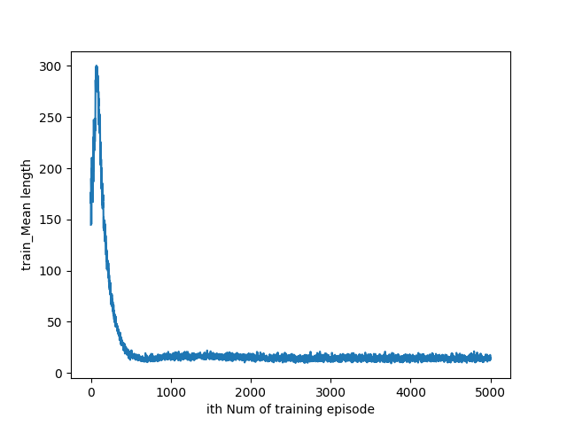

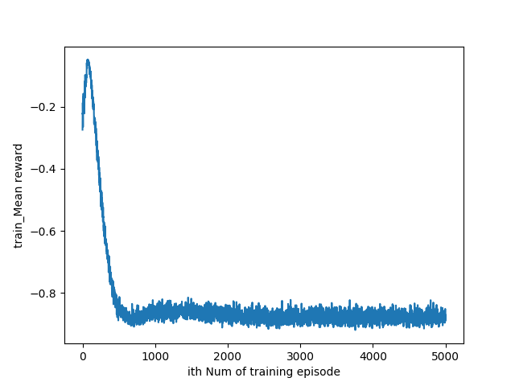


***learning_rate=0.0001,hidden layer(100) { linear transformation + ReLU }***

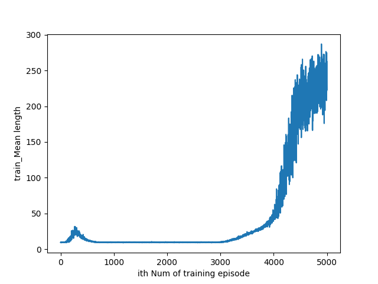


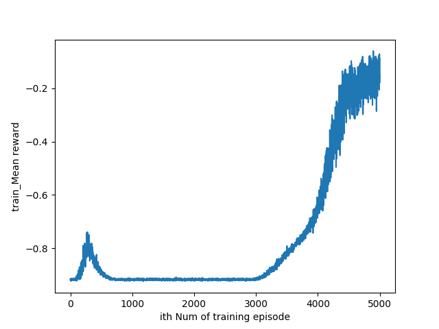

***思考：*** 由于Cart-Pole 游戏比较简单, 线性近似的动作值函数能用更少的训练步骤达到目标, 且受参数初始化的影响较小; 但极易overfitting, 且不好控制训练的时间及量. 相反, 含单层隐藏层的前馈神经网络需要更多的训练步骤达到目标值, 但相比于线性近似更稳定. 并且最终收敛效果也更好.


### online Q-learning


从这里开始我们将仅仅使用神经网络来近似动作值函数,

在 offline-Q-learning 中训练前馈神经网络用的是离线的数据, 且每次输入模型的数据量可以自由控制, 一旦训练次数偏多或每次的训练量偏大易造成overfitting, 这里我们每次输入的数据即进行中的 episode 的最新一步的反馈, 即每次只根据一个数据的信息更新动作值函数的参数.

为了让模型更好、更快的学习, 在训练过程中, 我们采用 epsilon-greedy Q-learning 算法, epsilon rate=0.05, 即有0.05 的概率使用随机策略, 而在测试过程中则全部采用值函数给出的action.

根据之前的经验,  学习率、优化器分别是 0.001, Adam；其它的设置与之前的单隐藏层前馈神经网络一致. 更多的,为了防止初始化参数带来的偏差, 我们训练一百个模型, 观察平均的步长和回报


***online Q-learning 的学习曲线***

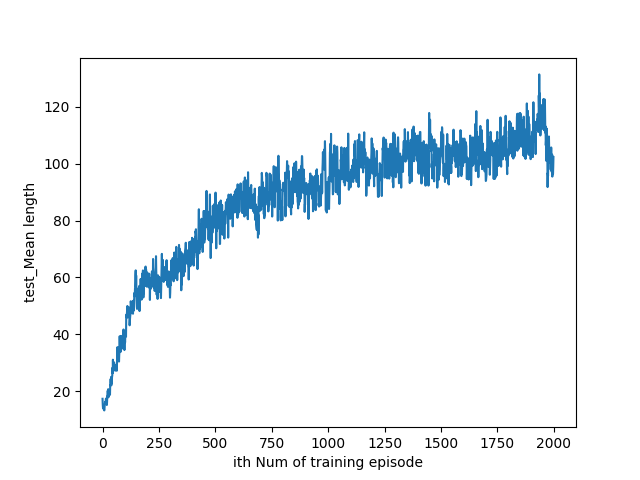


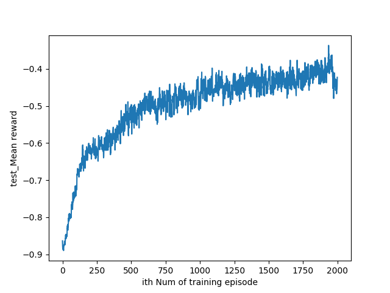

***思考***: 虽然, 每个 episode 的平均步长为120还远远未到达目标步长300, 但从学习曲线得知, 我们的模型一直在学习如何更好的控制平衡杆, 随着训练时间的增加, 会逐渐接近设定的目标, 相比于offline Q-learning,  online Q-learning 会更稳定的学习,  虽然消耗的训练时间更多. 

PS:　Note that with the automatic gradient computation in tensorflow,you must apply a stop gradient operation to avoid adapting the learning target.


### Different Neural Size 


这里我们使用不同的neural size, 测试online Q-learning的性能

neural size=30

或者

neural size=1000


### Experience Replay and Target Parameter


Deep Q-NetWork 是近些年提出的一种增强学习模型, 相比于传统的Q-learning 算法, 其增加了两个重要的机制：经验回放、目标函数参数固定.

NIPS DQN在基本的Deep Q-Learning算法的基础上使用了Experience Replay经验池. 通过将训练得到的数据储存起来然后随机采样的方法降低了数据样本的相关性, 提升了性能, 接下来, Nature DQN做了一个改进, 就是增加Target Q网络. 也就是我们在计算目标Q值时使用专门的一个目标Q网络来计算, 而不是直接使用预更新的Q网络. 

这样做的目的是为了减少目标计算与当前值的相关性.


如上面的损失函数公式所示, 计算目标Q值的函数使用的参数是,相比之下, Nips 版本DQN 的 目标Q网络是随着Q网络实时更新的, 这样会导致 目标Q值与当前的Q值相关性较大, 容易造成过度估计（over estimation）问题

 因此提出单独使用一个目标Q网络. 那么目标Q网络的参数如何来呢？还是从Q网络中来, 只不过是延迟更新. 也就是每次等训练了一段时间再将当前Q网络的参数值复制给目标Q网络.


**在Q-learning 中仅加入 Experience Replay效果如下:**

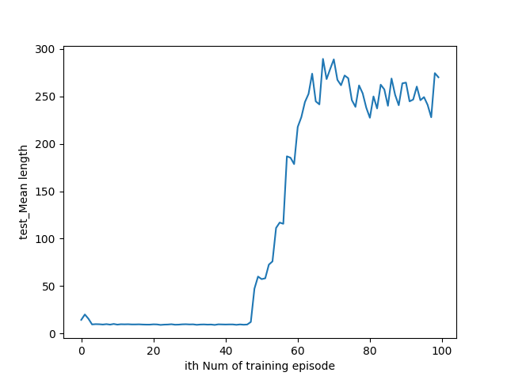

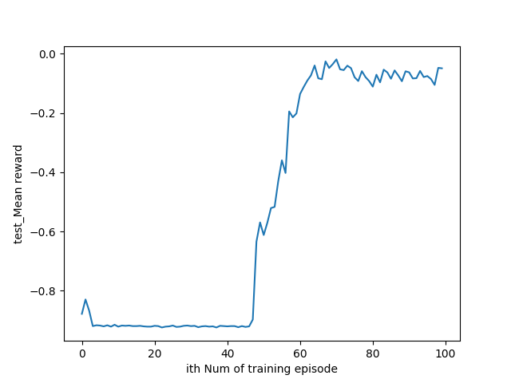

***在 Q-learning中仅加入Target Parameter机制***

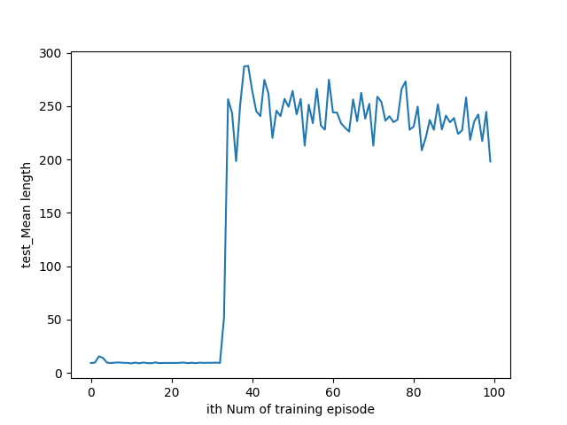

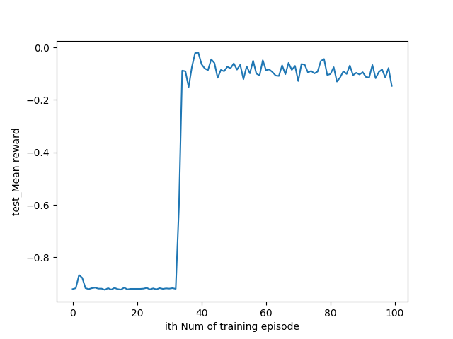

***思考***:  从学习曲线中可以看出, 分别加入两个机制 都对算法的学习性能有较大的提升, 因其分别减少了数据之间、Q值与目标Q值之间的相关性, 降低了overfitting 和过度估计的可能性, 因此可推断同时加入两个机制应该有更大的提升. 


### Double Q-learning


在上面的 target-parameter 中, 对于target Q值 与目前Q 值, 我们使用同一个Q网络, 只不过参数更新的频率不一样.

而在double Q-learning 里,为了减少因为目标Q值里 max Q值计算带来的计算偏差, 或者称为过度估计（over estimation）问题, 我们训练两个网络; 用当前的Q网络来选择动作, 用目标Q网络来计算目标Q. 算法步骤如下图:

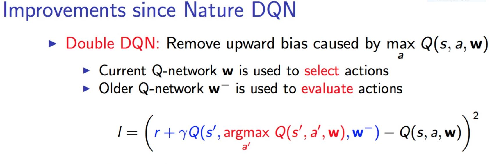

***Double Q-Learning 的学习曲线***


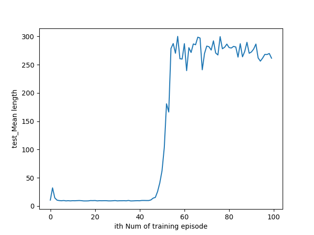

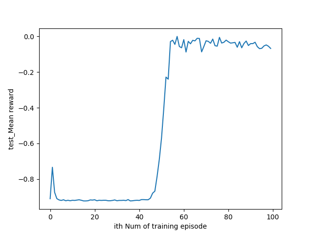

***思考***:  减少目标Q值计算的过度估计 看起来也有积极的效果对于提升算法的性能


## Atari Game(pong、Boxing、Mspacman)：


这里我们关注经典强化学习算法在 Atari 游戏上的 表现, (Pong、Mspcaman、Boxing), 相应的 我们用cnn 代替上面的前馈神经网络和线性转换作为动作值函数近似. 

***网络设置与数据预处理***

将环境给的每一张反馈图片压缩成28×28×1的灰阶格式, 将每四张处理过的图片连接在一起(28×28×4),存储格式为(tf.uint8) , 环境的名称分别为“Pong-v0”, “MsPacman-v0”, and “Boxing-v0” (没有-ram).

使用卷积神经网络近似Q-function. 第一层的过滤器大小为6×6、步长为2、16个channel, 连接Relu 激活函数;

第二层的过滤器大小为4×4、步长为2、32个channel, 连接Relu 激活函数;

第三层为全连接层, 神经元数为256, 连接ReLU 函数

最后通过线性转换预测状态动作值函数, 每个动作连接一个output(预测值).

epsilon rate =0.1、discount count=0.99、设置环境给的reward 为-1或0或1、minibatch size=32.

优化器为 RMSProp 、learning rate=0.001.

加入 experience replay(至少100000 transitions) 和 target network(更新 每5000步) 机制在Q-Learning .


### Random Policy


使用随机策略 观测 各个游戏 的平均回报 与时长.


### untrained Cnn+DQN


使用没有训练过的卷积神经网络作为 动作值函数的近似, 根据初始化的参数进行游戏, 观察DQN 算法在各个游戏上的效果. 


------


# 相关的链接:

[Atari+Deep RL](https://arxiv.org/abs/1312.5602)

[Double-Q-learning](http://papers.nips.cc/paper/3964-double-q-learning)

[Deep-RL with Double Q-Learning](https://arxiv.org/abs/1509.06461)

[Human-level control through deep reinforcement learning](https://www.nature.com/articles/nature14236)

